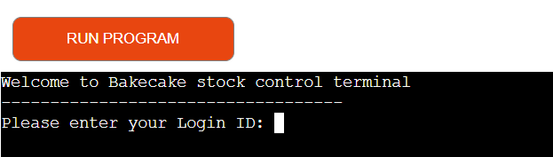
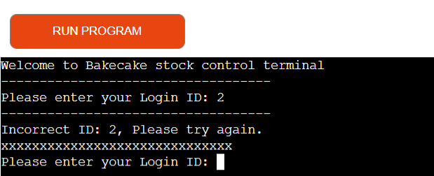
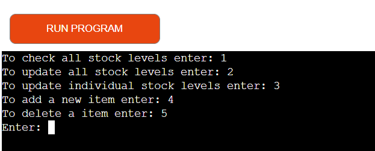
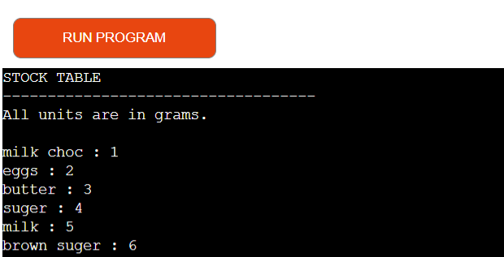
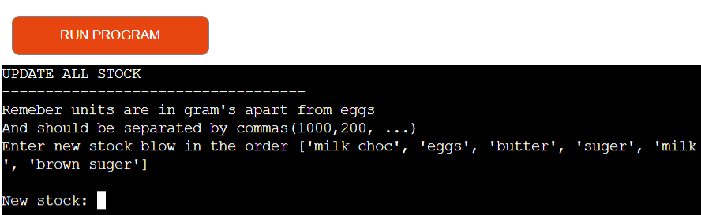
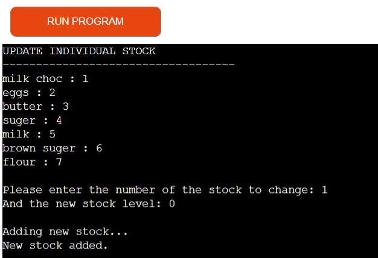
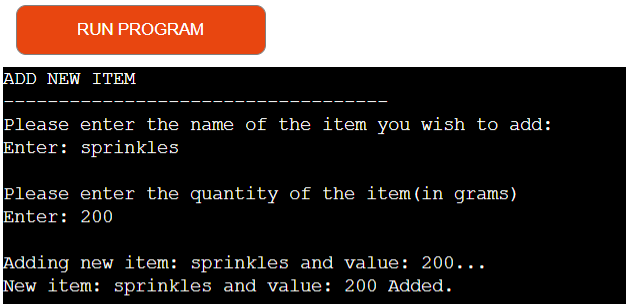
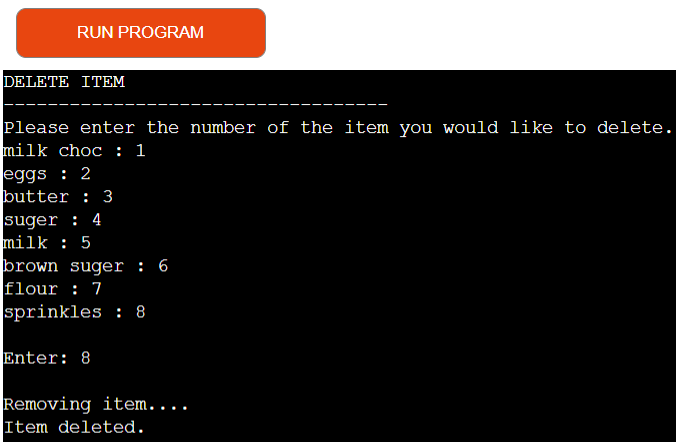
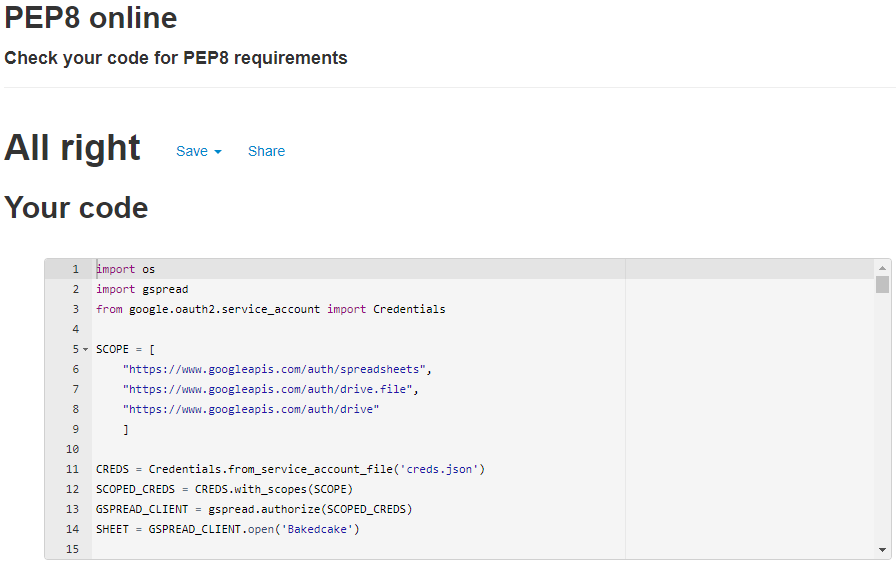

# BakedCake stock control terminal

This python project is a stock control modal, which as been built in the for a baking company. But can easily be used for any business.

Users can check, update all or update individual stock levels, as well as being able to add or remove items.

[View the live project here.](https://baked-cake.herokuapp.com/)

## How to use the site

* First the user be asked to provide a login, so not anyone can have access to the program. The current ID being 1.
* Next the user will be asked wich task they would like to perform, which can be selected through the numbers prodived.
* After the task is completed you will be asked if you wish to continue or logout.
    * continuing will be the user back to the choice of tasks and loging out will bring the user back to the login page.

## User Experience (UX)

## User Goals

* As a user I want to be able to easily be able to: 
    * Get all stock levels 
    * Update all stock levels
    * Update individual stock levels
    * Add new items 
    * Delete items.

## Features

### Login ID
* User is asked for a login ID in order to access program.

 
* If user doesn't prodive the correct login an error will form and ask for the ID again.

### Give to user the choice of avaible option to take.

* The user can the select which option by entering the number.

#### Entering 1 prints out a stock table

#### Entering 2 allows the user to update all stocks

* This tells the user how to enter the new information.

#### Entering 3 allows the user to update individual stocks

* This allows the user to update individual stocks if not all need to be updated.

#### Entering 4 allows the user to add a new item

#### Entering 5 allows the user to delete an item if needed

## Input validation and error checking

The code uses try expect statements in order to validate the users input to catch error and keep the program running correctly.

###  Features Left to Implement

* Add different access ID allowing for some features to only be avaible to higher up users(like delete).

## Testing

I have manually tested this project by:

### Validator Testing

* passing the code through [PEP8 linter](http://pep8online.com/).

* Giving invalid inputs Eg: passing to many numbers to update, strings for numbers, wrong ID.
* I have done this testing throughout building my project in my local and Code Institue Heroku terminals.

I have also giving the link to my Heroku app to friends and family in order for them to test it to.

### Fixed Bugs 

### Unfixed Bugs

## Technologies Used

### Languages Used

* [Python](https://en.wikipedia.org/wiki/Python_(programming_language)).

### Framework, Libraries and Programs used

* [Google sheets](https://www.google.co.uk/sheets/about/)
* [Google Cloud](https://cloud.google.com/)
* [Heroku](https://signup.heroku.com/login)

## Deployment

### Delpoying to Heroku

1. In order for Heroku to install dependenies for the project to run you need to add your requirements to requirements.txt. In order to do this you need to type:
pip3 freeze > requirements.txt in to the terminal.(The files name needs to be exactly the same in order to work).
2. Next you need to commit and push the changes to git hub.
3. Now you need to create or login in to your [Heroku](https://signup.heroku.com/login) account.
4. Press create new app.
5. Give your app a unique name and select you're region. Then click create app.
6. Now you've created the new app had to the settings page using the navigation bar at the top.
7. Now find the config vars, and create one.
8. In the field for key enter CREDS and for the value copy and paste the entire creds.json file.
9. Next add another config var, with the key being PORT and the value being 8000.
10. Now add 2 build packs(found under config vars) the first being python and the second being nodejs. Make sure that python is ontop.
11. Next scrool back to the top and click on the delopy button.
12. Select GitHub for your deplyment method. Then confirm you want to connect to GitHub.
13. Now you can search for you GitHub repositorie.
14. Lastly scroll down to manualy deploy and press deploy branch. (after the app is deployed you can enable automatic deploys to update your app every time you push to GitHub).
15. Now your code is a Heroku app.

### Forking the GitHub Repository

Forking the repository allows us to have a copy of the original repository to view and make changes on our GitHub account with affecting to original work. Forking a repository can be done with the following steps.

1. Log in to GitHub and locate the [GitHub Repository](https://github.com/)
2. At the top right of the repository above settings, find and click the fork button. 
3. You will now have a copy in your account.

## Credits

* Code Institue for:
    * Deployment terminal
    * Setting up and accessing google sheets
    * validating strings into numbers and checking the number of them

[DelfStack](https://www.delftstack.com/howto/python/python-clear-console/) for code to clear the terminal. 

### Acknowledgements
