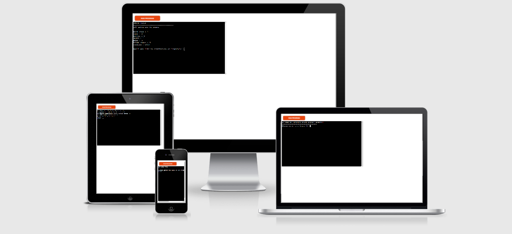

# BakedCake stock control terminal

This python project is a stock control modal, which as been built in the for a baking company. But can easily be used for any business.

Users can check, update all or update individual stock levels, as well as being able to add or remove items.

[View the live project here.](https://baked-cake.herokuapp.com/)

## User Experience (UX)

* ## Use Goals

## Features

###  Features Left to Implement

## Testing

### Validator Testing

### Fixed Bugs 

### Unfixed Bugs

## Technologies Used

## Deployment

### Forking the GitHub Repository

Forking the repository allows us to have a copy of the original repository to view and make changes on our GitHub account with affecting to original work. Forking a repository can be done with the following steps.

1. Log in to GitHub and locate the [GitHub Repository](https://github.com/)
2. At the top right of the repository above settings, find and click the fork button. 
3. You will now have a copy in your account.

## Credits

### Code 

### Acknowledgements
