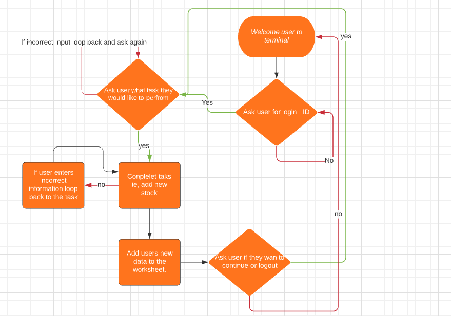

# BakedCake stock control terminal

This python project is a stock control model, which as been built for a baking company, but can easily be used for any business.

Users can check, update all or update individual stock levels, as well as being able to add or remove items.

[View the live project here.](https://baked-cake.herokuapp.com/)

## How to use the site

* First, the user will be asked to provide a login, so not anyone can have access to the program. The current ID being 1.
* Next, the user will be asked which task they would like to perform, which can be selected through the numbers provided.
* After the task is completed you will be asked if you wish to continue or logout.
    * continuing will take the user back to the choice of tasks and logging out will bring the user back to the login page.

## User Experience (UX)

## User Goals

* As a user I want to be able to easily be able to: 
    * Get all stock levels 
    * Update all stock levels
    * Update individual stock levels
    * Add new items 
    * Delete items.

## Flow Chart

## Features

### Login ID
* User is asked for a login ID in order to access the program.

 
* If user doesn't provide the correct login an error will form and ask the users for their ID again.

### Give to user a choice of available options to take.

* The user can the select which option by entering the number.

#### Entering 1 prints out a stock table

#### Entering 2 allows the user to update all stock levels

* This tells the user how to enter the new information.

#### Entering 3 allows the user to update individual stock levels

* This allows the user to update individual stock levels if not all need to be updated.

#### Entering 4 allows the user to add a new item

#### Entering 5 allows the user to delete an item if needed

## Input validation and error checking

The code uses try except statements in order to validate the users input to catch error and keep the program running correctly.
* Using these statements means you can tell the use what went wrong by inputing your own value errors, not leaving the user a wall of error text.

###  Features Left to Implement

* Add different access IDs allowing for some features(like delete) to only be available to higher up users(like managers).

## Testing

I have manually tested this project by:

### Validator Testing

* passing the code through [PEP8 linter](http://pep8online.com/).

* Giving invalid inputs Eg: passing too many numbers to update, strings for numbers, wrong ID.
* I have done this testing throughout building my project in my local and Code Institue Heroku terminals.

I have also given the link to my Heroku app to friends and family in order for them to test it too.

### Fixed Bugs 
* When adding the ability to add or delete items from the stock sheet, the update all function wouldn't work as it was set to 7. To fix this I added code to count the number of items in the sheet and use that for the number so it was always the correct amount.
* When adding new stock to the worksheet, numbers would get added to the wrong stocks, this was caused by a missing space in the for loop.

### Unfixed Bugs
* If you add or delete an item, the terminal won't update the change until you restart the terminal.(To get around this, I told the user to restart the program and used the exit() function to stop the terminal running.)

## Technologies Used

### Languages Used

* [Python](https://en.wikipedia.org/wiki/Python_(programming_language)).

### Framework, Libraries and Programs used

* [Google sheets](https://www.google.co.uk/sheets/about/)
* [Google Cloud](https://cloud.google.com/)
* [Heroku](https://signup.heroku.com/login)
* [Lucidchart](https://www.lucidchart.com/)

## Deployment

### Delpoying to Heroku

1. In order for Heroku to install dependencies for the project to run you need to add your requirements to requirements.txt. In order to do this you need to type:
pip3 freeze > requirements.txt in to the terminal.(The files name needs to be exactly the same in order for it to work).
2. Next you need to commit and push the changes to git hub.
3. Now you need to create or login to your [Heroku](https://signup.heroku.com/login) account.
4. Press create new app.
5. Give your app a unique name and select your region. Then click create app.
6. Now you've created the new app head to the settings page using the navigation bar at the top.
7. Now find the config vars and create one.
8. In the field for key enter CREDS and for the value, copy and paste the entire creds.json file.
9. Next, add another config var, with the key being PORT and the value being 8000.
10. Then, add 2 build packs(found under config vars). The first being python and the second being nodejs. Make sure that python is on top.
11. Next scroll back to the top and click on the delopy button.
12. Select GitHub for your deployment method. Then confirm you want to connect to GitHub.
13. Now you can search for you GitHub repositorie.
14. Lastly scroll down to manual deploy and press deploy branch. (after the app is deployed you can enable automatic deploys to update your app every time you push to GitHub).
15. Now your code is a Heroku app.

### Forking the GitHub Repository

Forking the repository allows us to have a copy of the original repository to view and make changes on our GitHub account with out affecting the original work. Forking a repository can be done with the following steps.

1. Log in to GitHub and locate the [GitHub Repository](https://github.com/)
2. At the top right of the repository above settings, find and click the fork button. 
3. You will now have a copy in your account.

## Credits

* Code Institue for:
    * Deployment terminal
    * Setting up and accessing google sheets
    * validating strings into numbers and checking the number of them

* Help with updating individual cells [Youtube](https://www.youtube.com/watch?v=yPQ2Gk33b1U)

* [DelfStack](https://www.delftstack.com/howto/python/python-clear-console/) for code to clear the terminal. 

### Acknowledgements
* My Mentor for feedback throughout the project.
* Friends and family for help with testing and feedback.